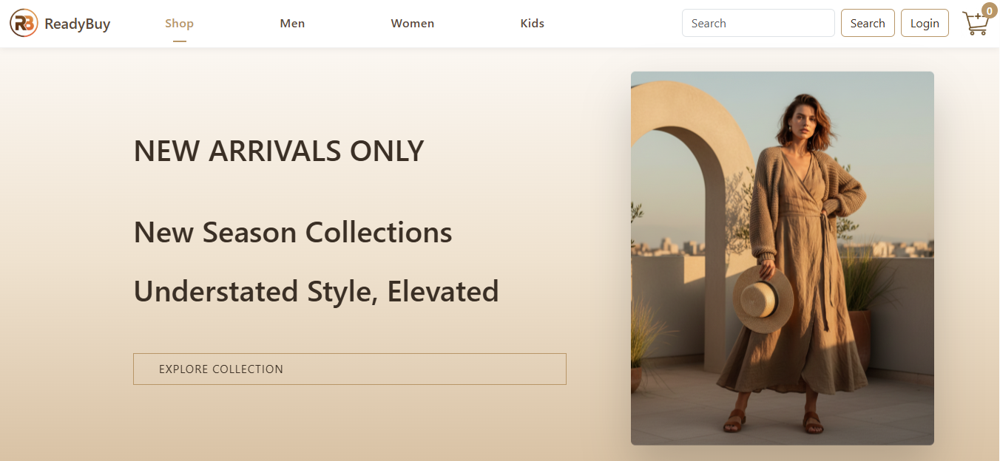
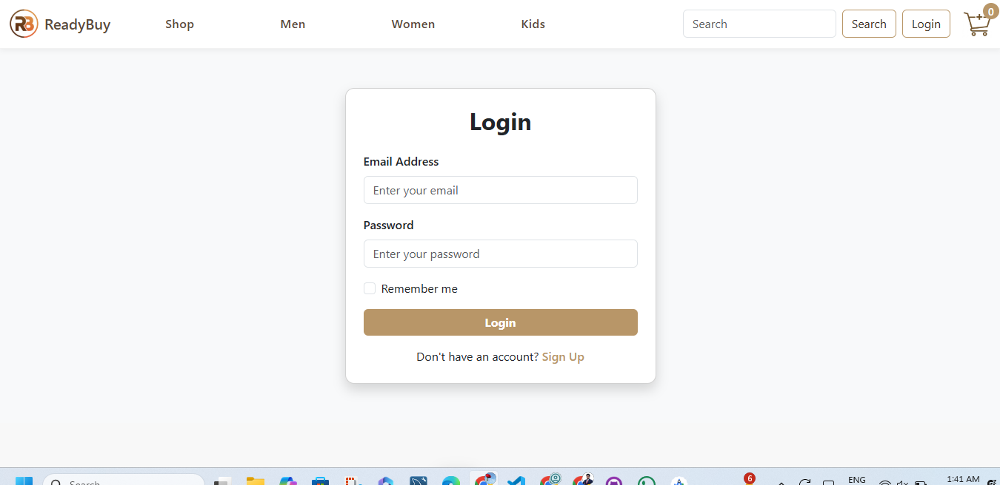
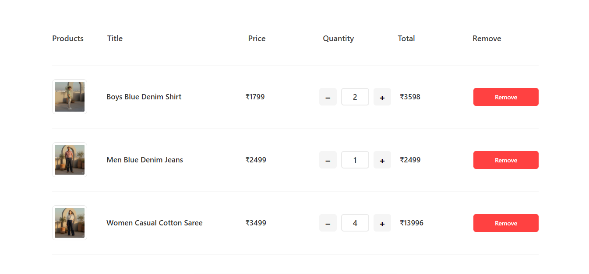
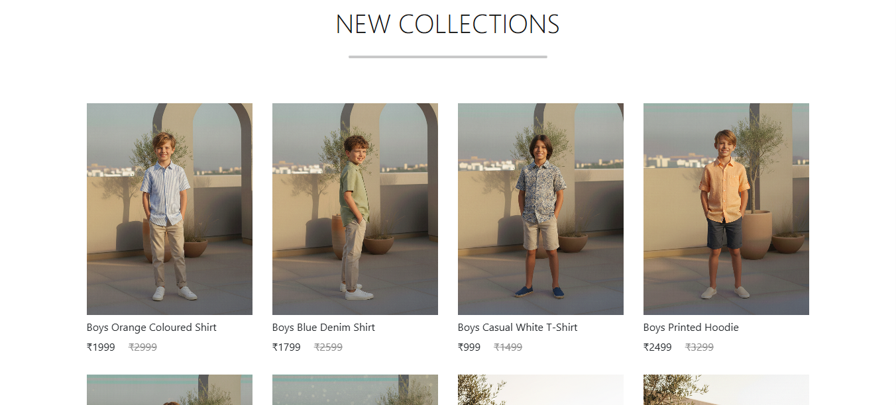

# 🛒 E-commerce Frontend (React)


A modern and responsive E-commerce Frontend built using **React, CSS, and Bootstrap**.  
This project is a fully designed frontend UI that simulates a real-world online shopping website with multiple sections like Men, Women, Kids, Cart, Login, Filters, and more.

---

## ✨ Features

- Home page with product listings  
- Men, Women & Kids sections  
- Login page UI  
- Shopping Cart functionality  
- Product filtering and browsing  
- Product detail design
- Fully responsive design (Mobile + Desktop)  
- Clean UI using Bootstrap & CSS  
- Component-based architecture with React  

---

## 🧰 Tech Stack

- **Frontend Library:** React.js  
- **Styling:** CSS3 + Bootstrap  
- **Language:** JavaScript (ES6)  
- **Routing:** React Router  
- **Package Manager:** npm  

---

## 📂 Project Structure
```
E-commerce-Frontend/
│
├── public/ # Static files
├── src/
│ ├── components/ # Reusable components
│ ├── pages/ # Pages (Home, Login, Cart, etc.)
│ ├── assets/ # Images & icons
│ ├── styles/ # CSS files
│ ├── App.js # Main App component
│ └── index.js # Entry point
│
├── package.json
└── README.md
```

---

## 🚀 Getting Started

Follow these steps to run the project locally:

### 1️⃣ Clone the Repository
```bash
git clone https://github.com/Anurag-3112/E-commerce-Frontend.git
```

### 2️⃣ Navigate to the Project Folder
```bash
cd ReadyBuy
```

### 3️⃣ Install Dependencies
```
npm install
```
### 4️⃣ Start the Development Server
```
npm start
```

The app will run on:
```
http://localhost:3000
```

---

### 🛍️ Pages Included

- Home Page
- Login Page
- Cart Page
- Product Listing Page
- Men Sectiom
- Women Section
- Kids Section
- Filter & Category Pages

---

### 🎨 UI Highlights

- Responsive layout using Bootstrap
- Modern product card design
- Clean and minimal interface
- Easy navigation between sections
- Mobile-friendly design

---

### 🔮 Future Enhancements

- Backend Integration (Node.js / Express / Firebase
- Authentication System (JWT / Firebase Auth)
- Payment Gateway Integration (Stripe / Razorpay)
- Wishlist Feature
- Search Functionality
- Order History

--- 

## 📸 Screenshots

### 🏠 Home Page


### 🔐 Login Page


### 🛒 Cart Page


### 👕 Products Section


---

### 🌐 Live Demo
https://e-commerce-1lc5psklq-anurag-3112s-projects.vercel.app/


---

### 🤝 Contributing


Contributions are welcome!
1. Fork the repository
2. Create a feature branch
```
git checkout -b feature-name
```
3. Commit your changes
```
git commit -m "Add new feature"
```
4. Push to your branch
```
git push origin feature-name
```
5. Open a Pull Request

---

### 👨‍💻 Author

### Anurag
GitHub: https://github.com/Anurag-3112

---

### 📄 License

This project is open-source and available under the MIT License.
```
::contentReference[oaicite:0]{index=0}
```
